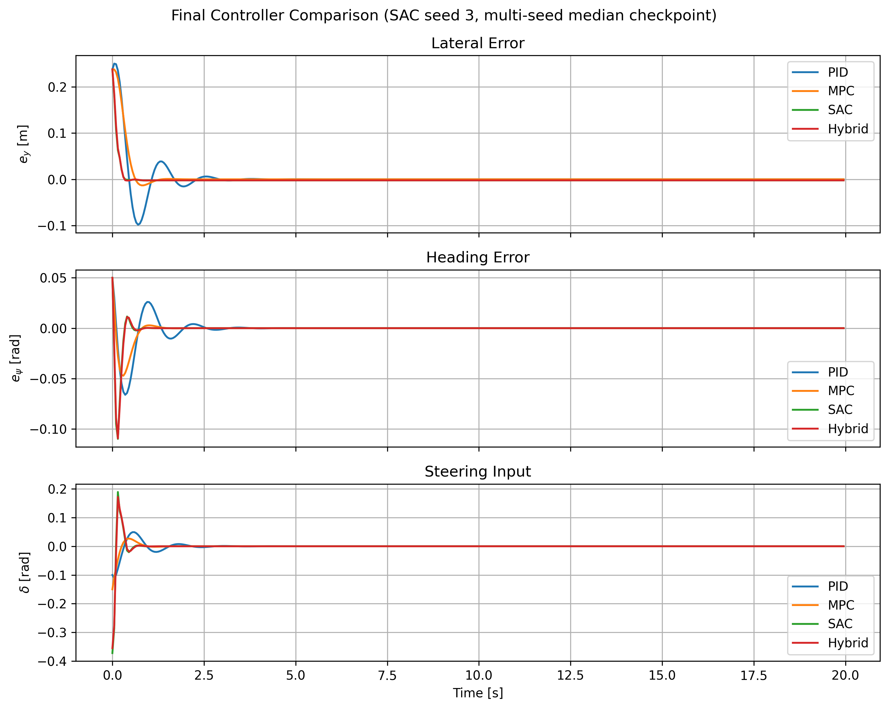

# Hybrid SAC + MPC for Vehicle Lateral Control

> A closed-form blend of a Soft Actor-Critic policy and a constrained linear MPC for the canonical CAV lateral-control problem on a linearized lateral bicycle model. Combines the tracking quality of deep RL with the actuator-envelope and interpretability of MPC, exposed through a single monotone blending coefficient.

[](https://www.python.org/)
[](https://pytorch.org/)
[](LICENSE)
[](https://arxiv.org/abs/2608.17258)

📄 **Paper:** [arXiv:2608.17258](https://arxiv.org/abs/2608.17258)
👤 **Author:** Farzaneh Tatari · [ORCID 0000-0001-5176-3372](https://orcid.org/0000-0001-5176-3372)
📊 **Venue:** arXiv preprint, 2026

> *This work was performed independently by the author on personal time and does not reflect the views, positions, or products of any employer.*

---

## Headline result

A hybrid controller that **matches the tracking quality of stand-alone SAC** while remaining inside the MPC's actuator envelope and preserving a deterministic, model-based contribution at every step.

| Controller | RMSE(eᵧ) [m] | max \|eᵧ\| [m] | mean \|δ\| [rad] |
| --- | --- | --- | --- |
| PID | 0.0319 | 0.250 | 2.79 × 10⁻³ |
| Linear MPC | 0.0283 | 0.2375 | 1.55 × 10⁻³ |
| SAC (deep RL) | 0.0167 ± 0.0006 | 0.2375 | 3.02 × 10⁻³ |
| **Hybrid (λ = 12)** | **0.0171 ± 0.0006** | **0.2375** | **2.90 × 10⁻³** |

Nominal initial-condition recovery task, x₀ = (0.2, 0.05, 0, 0), T = 20 s. SAC and Hybrid: mean ± std over five SAC training seeds. PID and MPC are deterministic.

**What the hybrid does and does not guarantee (from the paper):**
- **Guaranteed by construction:** per-step actuator magnitude bound `|δ_k| ≤ δ_max` via the final saturation, and a non-zero deterministic model-based contribution to every steering command bounded below by `(1 − α) δ_max`.
- **Not guaranteed:** the input-rate constraint over the blended horizon; recursive feasibility; terminal invariance; prevention of corner-case divergences when the SAC action saturates in the wrong direction (see paper Section 8.4, and the "Limitations" section below).



---

## Repository layout

```
.
├── sim/                # vehicle dynamics and reference path
│   ├── vehicle_model.py        # 4-state linearized lateral bicycle
│   ├── integrator.py           # forward-Euler discretization
│   ├── reference_path.py
│   └── scenario.py
├── controllers/        # the four controllers benchmarked
│   ├── pid_baseline.py
│   ├── mpc_controller.py
│   ├── linear_mpc_controller.py        # linear MPC (QP via OSQP)
│   ├── linear_mpc_controller_w_Tnng_Rbst.py  # tuned + robustness variant
│   ├── mpc_filter_controller.py        # closed-form hybrid blend
│   └── base_controller.py
├── rl/                 # SAC training/eval (stable-baselines3)
│   ├── env.py                  # gymnasium env on the bicycle plant
│   ├── reward.py               # r = −2.0 eᵧ² − 1.0 eψ² − 0.05 δ² − 0.1 (δ − δ_prev)²
│   ├── train_sac.py
│   ├── evaluate_sac.py
│   └── policy_loader.py
├── experiments/        # reproducible evaluation entrypoints
│   ├── run_baseline.py
│   ├── run_mpc_tuning.py        # 243-config grid search (Sec. 4)
│   ├── run_hybrid_tuning.py     # λ sweep (Table 3)
│   ├── run_comparison.py
│   ├── run_multi_seed.py        # 5-seed SAC training at 150k steps
│   ├── run_multi_ic.py          # 5×5 IC grid × 5 seeds (Table 5)
│   ├── run_robustness.py
│   ├── run_robustness_quant.py  # Cases A–D (Table 4)
│   ├── run_final_results.py     # final figure regeneration
│   ├── metrics.py
│   └── HOW_TO_RUN.md
├── configs/            # experiment configs
│   ├── base.yaml
│   ├── sac.yaml
│   ├── mpc.yaml
│   └── experiments.yaml
├── tests/              # unit tests
│   ├── test_vehicle_model.py
│   ├── test_env.py
│   └── test_metrics.py
├── utils/              # io, logger, plotting, seed helpers
└── results/            # generated outputs (git-ignored)
    ├── models/         # SAC checkpoints (sac_seed{0..4}.zip)
    ├── tables/         # CSV summaries
    ├── figures/        # PNG figures
    └── logs/
```

---

## Quick reproduction

```bash
# 1. clone
git clone https://github.com/FarzanehTatari/hybrid-sac-mpc-lateral-control.git
cd hybrid-sac-mpc-lateral-control

# 2. set up the environment
python -m venv .venv && source .venv/bin/activate
pip install -r requirements.txt

# 3. quick smoke test — run the PID/MPC/SAC/Hybrid comparison
python -m experiments.run_comparison
```

The full paper numbers come from the three commands below, in order. Together they reproduce **Tables 2, 4, 5** and the headline figure.

```bash
# (a) train SAC at 150k steps × 5 seeds (paper Section 5)
#     ~25–60 min on Apple Silicon CPU
python -m experiments.run_multi_seed

# (b) multi-IC ensemble: 5×5 IC grid × 5 SAC seeds (Table 5)
#     ~5–10 min
python -m experiments.run_multi_ic

# (c) quantitative robustness: Cases A–D (Table 4)
#     ~2–5 min
python -m experiments.run_robustness_quant
```

After (a)–(c), summary CSVs land in `results/tables/`:
- `multi_seed_summary.csv` — mean ± std across the 5 seeds
- `multi_ic_summary.csv` — mean ± std across 125 (seed, IC) pairs
- `robustness_quant_summary.csv` — per-case mean ± std

To reproduce **Table 3** (λ sweep) and the MPC weight grid search:

```bash
python -m experiments.run_hybrid_tuning   # Table 3, λ ∈ {1,2,3,5,8,10,12,15}
python -m experiments.run_mpc_tuning      # 243-config grid for Q, R, Rd
```

To regenerate the final figures (after the multi-seed run):

```bash
python -m experiments.run_final_results
```

---

## Vehicle and controller details

**Plant.** Linearized lateral bicycle model with state x = (eᵧ, eψ, vᵧ, r) and steering-angle input δ. Forward-Euler discretization at Δt = 0.05 s. Implemented in `sim/vehicle_model.py`.

Nominal parameters (`configs/base.yaml`):
m = 1600 kg, Iz = 2500 kg·m², lf = 1.2 m, lr = 1.6 m, Cf = Cr = 80000 N/rad, vx = 15 m/s.

**Linear MPC** (`controllers/linear_mpc_controller.py`).
QP over horizon N = 15 with input bound |δ| ≤ 0.4 rad and rate bound |δ − δ_prev| ≤ 0.15 rad. Solved with OSQP. Tuned weights via grid search over 243 configurations (`experiments/run_mpc_tuning.py`).

**SAC policy** (`rl/`).
stable-baselines3 default `MlpPolicy` (2 × 256 hidden units, ReLU). Reward in `rl/reward.py`:

```
r = −2.0 eᵧ² − 1.0 eψ² − 0.05 δ² − 0.1 (δ − δ_prev)²
```

Replay buffer 50000, 1000 learning-start steps, **150000 training steps**, 5 independent seeds (the per-paper run is launched via `experiments/run_multi_seed.py`, not the standalone `rl/train_sac.py`).

**Hybrid** (`controllers/mpc_filter_controller.py`).
Applied steering δ = sat_{δmax}((1 − α(λ)) δ\*MPC + α(λ) δSAC) with α(λ) = λ / (1 + λ). Selected λ = 12.

---

## Environment / pinned versions

From `requirements.txt`:

- numpy, scipy, pandas, matplotlib, pyyaml
- gymnasium
- stable-baselines3 (SAC implementation; pulls in PyTorch)
- osqp (QP solver for the MPC)
- casadi

Tested on Python 3.10+ on Apple Silicon CPU. GPU is optional — SAC training is fast enough on CPU for this plant.

---

## Tests

A small unit-test suite covers the vehicle model, the gymnasium environment, and the metric computation:

```bash
python -m pytest tests/
```

---

## Citation

If you use this code or the ideas from the paper, please cite:

```bibtex
@misc{tatari2026hybrid,
  title         = {A Hybrid End-to-End and Modular Control Architecture Toward Safe Vehicle Lateral Control:
                    Combining Soft Actor-Critic with Model Predictive Control},
  author        = {Tatari, Farzaneh},
  year          = {2026},
  eprint        = {2608.17258},
  archivePrefix = {arXiv},
  primaryClass  = {cs.RO},
  doi           = {10.48550/arXiv.2608.17258},
  url           = {https://arxiv.org/abs/2608.17258}
}
```

If you want to cite this code archive specifically (as opposed to the paper), archive a tagged release on Zenodo and use that DOI.

---

## Limitations

The paper is explicit about the limitations of the implementation evaluated here:

- **Closed-form blend, not a full predictive safety filter.** The implementation in `controllers/mpc_filter_controller.py` is a closed-form convex blend of the MPC's first-step optimum and the SAC action; it does not solve the full constrained QP that incorporates the SAC action as a soft penalty inside the predictive horizon (Eq. 19 in the paper).
- **Linearized lateral bicycle, not a full nonlinear vehicle.** Tire-curve saturation, longitudinal coupling, and road-friction effects are not modeled.
- **Constant longitudinal speed** (vx = 15 m/s). Combined longitudinal–lateral control is left to future work.
- **Open-loop simulator only.** No CarSim / CARLA / on-vehicle validation.

---

## Roadmap

- [ ] Full constrained-QP predictive safety filter (Section 6, Eq. 19)
- [ ] Connectivity-aware V2X-scheduled λ extension (Section 9)
- [ ] Higher-fidelity vehicle model with tire-curve saturation
- [ ] Combined longitudinal + lateral control
- [ ] CarSim or CARLA co-simulation validation

**Companion paper in preparation** (from the arXiv version's conclusion) implements the full constrained-QP predictive safety filter of Eq. (19) with a terminal invariant set for formal recursive feasibility, empirically validates the V2X-scheduled λ extension, and evaluates the architecture on a nonlinear single-track vehicle model.

---

## License

MIT — see [LICENSE](LICENSE).

---

## Contact

- ✉️ fa_tatari@yahoo.com
- 💻 [GitHub](https://github.com/FarzanehTatari)
- 💼 [LinkedIn](https://www.linkedin.com/in/farzaneh-tatari-75296a115/)
- 🎓 [Google Scholar](https://scholar.google.com/citations?user=kocqXnAAAAAJ)

For questions about the code or to report a bug, open an issue.
